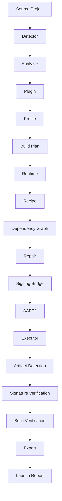

# ANBE Architecture

ANBE is built around an explicit staged build pipeline.

The architecture separates project discovery, build planning, execution,
artifact detection and release verification so each layer can evolve
independently.

## High-level flow



## BuildContext

`BuildContext` is the shared state passed through the pipeline.

It contains structured information such as:

- project metadata
- profile
- recipe
- build plan
- runtime configuration
- artifacts
- exports
- execution results
- release metadata

A formal schema validates this state throughout execution.

## Recipe model

ANBE recipes use typed steps rather than relying on a flat collection of
shell strings.

Steps contain:

- stable ID
- type
- command or Gradle task
- working-directory selector
- dependencies

`RecipeGraph` validates dependencies and rejects:

- missing dependencies
- duplicate IDs
- self-dependencies
- dependency cycles

## Execution planning

The execution planner transforms the dependency graph into ordered waves.

This allows execution order to be derived from dependencies rather than
hard-coded command position.

Gradle operations remain protected as exclusive build work.

## Release flow

Release mode adds:

```text
Signing configuration
        ↓
assembleRelease / bundleRelease
        ↓
Artifact detection
        ↓
APK signature inspection
        ↓
Build verification
        ↓
Export
        ↓
Launch readiness report
```

## Design goal

ANBE should eventually be able to receive a project and answer one question:

> What is required to turn this source tree into a verified Android
> application?

The current architecture is the foundation for that autonomous build model.
